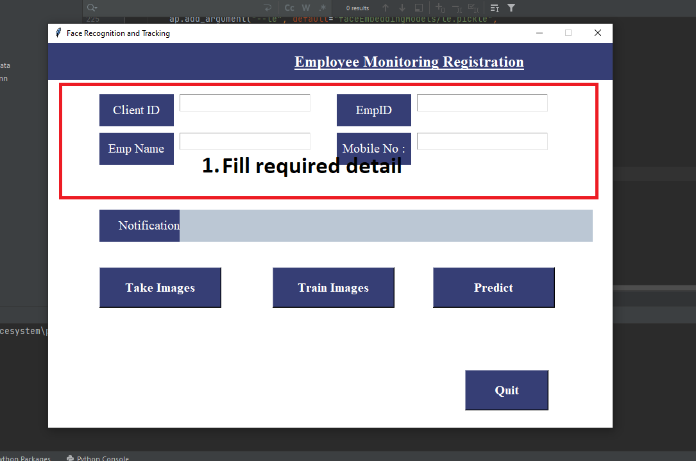
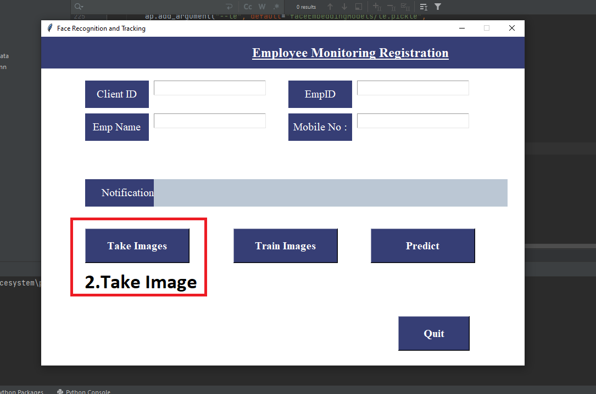
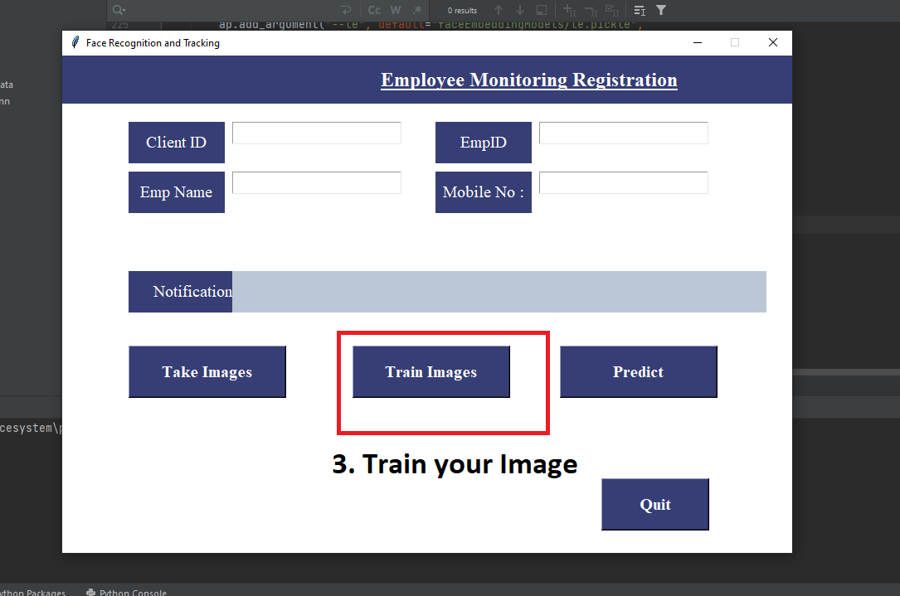
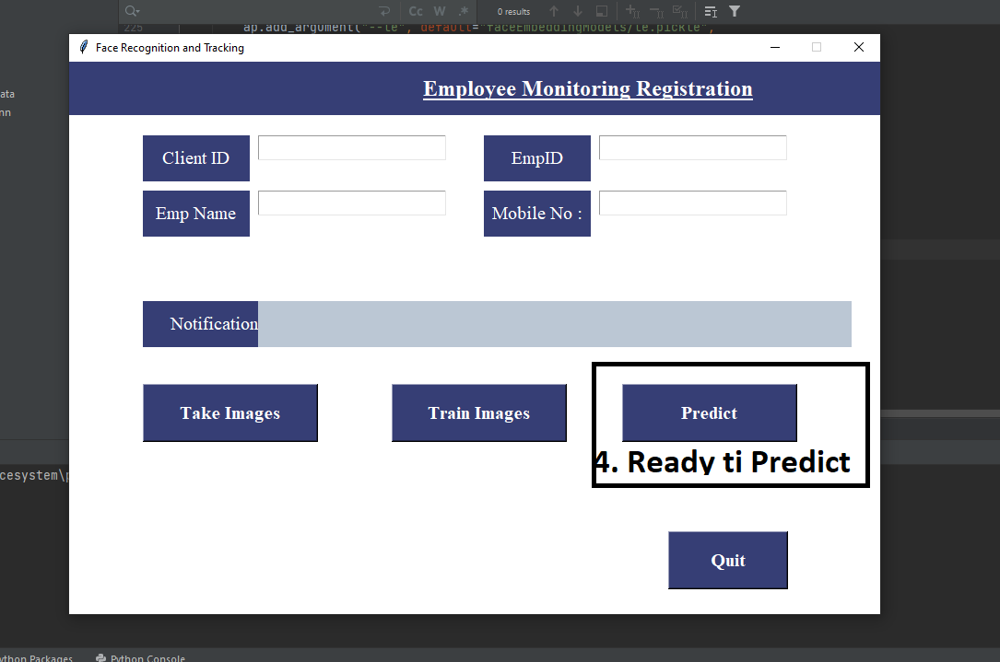

# Face Recognition and Identification Sysmen

This project is called Attendance System using facial Recognition.The goal of the project is to identify the Person and mark their attendacce.
1. The User has to register himself/herself in the application Providing the required details.
2. The application takes the multiple snaps(50) of the user and store it into the database.

3. once the registred user comes in front of camera,the application captures the image, send it to already stored image in database and marks the Attendance
if the user is present in the database.

## 🔗 Links
## Project link
(https://github.com/Jayed096/attendence-system)

## Video Demo
(https://www.youtube.com/watch?v=mZhd9TJizoU)

## Some of Screenshot:

